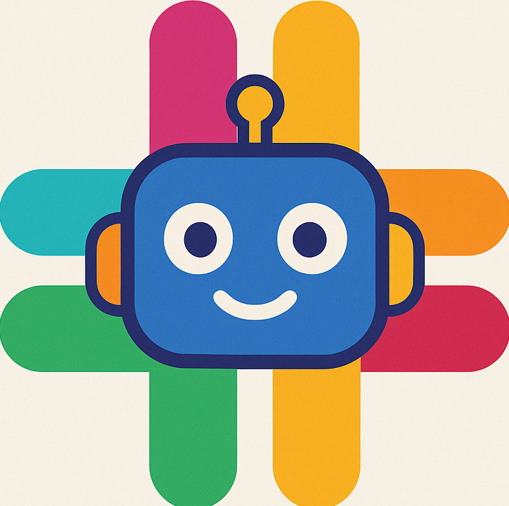

# Slack AI

This is an alternative frontend for Slack where the main content is a chronologial feed of all the channels instead of just the selected channel. You can select multiple channels and all of them will appear in the feed.

## Why?

This is mainly just a project for me to test AI Assisted programming. Initially I have been using Google's Gemini models using gemini cli

## Screenshots

Main page

